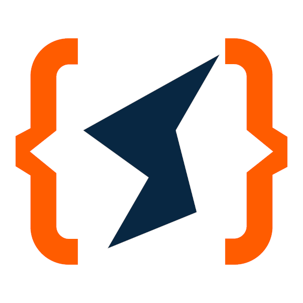
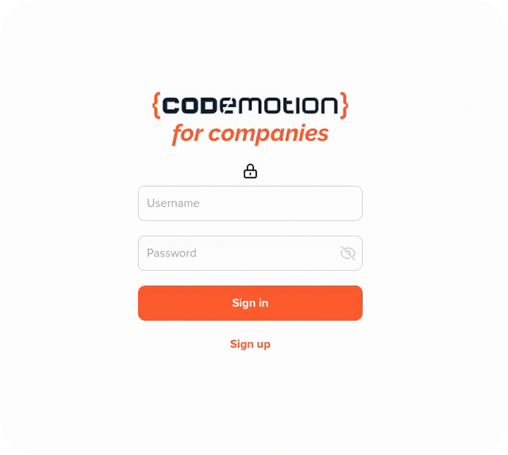

<div id="top"></div>

[![Contributors][contributors-shield]][contributors-url]
[![Forks][forks-shield]][forks-url]
[![Stargazers][stars-shield]][stars-url]
[![Issues][issues-shield]][issues-url]
[![MIT License][license-shield]][license-url]
[![LinkedIn][linkedin-shield]][linkedin-url]

<!-- PROJECT LOGO -->
<br />
<div align="center">
  <a href="https://github.com/alessandro-pagliara/codemotion-ui">
    
  </a>

  <h2 align="center">Codemotion UI</h2>

  <p align="center">
    Web Components UI library developed with Angular and Stencil.js discussed as case study @<a href="https://events.codemotion.com/conferences/online/2022/online-tech-conference-2022-italian-edition-spring">Codemotion2022</a>.
    <br />
    <br />
    <a href="https://github.com/alessandro-pagliara/codemotion-ui/issues">Report Bug</a>
  </p>
</div>

<!-- TABLE OF CONTENTS -->
<details>
  <summary>Table of Contents</summary>
  <ol>
    <li>
      <a href="#about-the-project">About The Project</a>
      <ul>
        <li><a href="#built-with">Built With</a></li>
      </ul>
    </li>
    <li>
      <a href="#getting-started">Getting Started</a>
      <ul>
        <li><a href="#prerequisites">Prerequisites</a></li>
        <li><a href="#installation">Installation</a></li>
      </ul>
    </li>
    <li><a href="#usage">Usage</a></li>
    <li><a href="#contributing">Contributing</a></li>
    <li><a href="#license">License</a></li>
    <li><a href="#contact">Contact</a></li>
  </ol>
</details>

<!-- ABOUT THE PROJECT -->

## About The Project

<br />

<div align="center">
    
</div>

<br />

The project aims to compare Angular and Stencil to create a library of <a href="https://developer.mozilla.org/en-US/docs/Web/Web_Components">Web Components</a> useful to implement a consistent Design System (built on top of Tailwind CSS) in a Microfrontend Architecture.

The case study consists in the creation of the UI components for a basic Auth Micro App.

The project is organized in 3 main folders:

```
.
├── angular               # Angular examples
│   ├── from-library      # Web Components from APF library
│   ├── from-scratch      # Web Components from scratch
├── stencil               # Stencil example
```

### Angular (from library)

In `angular/from-library` path you will find an example of an existing Angular project using an <a href="https://angular.io/guide/angular-package-format">APF</a> components library that can be converted into a Web Components library.

### Angular (from scratch)

In `angular/from-scratch` path you will find an example of an empty Angular project useful to create a library of Web Components from scratch.

### Stencil

In `stencil` path you will find an example of a Stencil <em>components</em> starter project.

<p align="right">(<a href="#top">back to top</a>)</p>

### Built With

As described above, the project is built with:

- [Angular](https://angular.io/)
- [Stencil.js](https://stenciljs.com/)
- [Tailwind](https://tailwindcss.com/)

<p align="right">(<a href="#top">back to top</a>)</p>

<!-- GETTING STARTED -->

## Getting Started

### Prerequisites

- [Node.js 16.14.2 LTS](https://nodejs.org/it/)

### Installation

1. Clone the repo

   ```sh
   git clone https://github.com/alessandro-pagliara/codemotion-ui.git
   ```

2. Install dependencies for every examples
   ```sh
   npm run install:all
   ```
   N.B: `ng-packagr`, the default module bundler for Angular libraries, has been patched in order to parse Tailwind directives, sorry ¯\\\_( ͡° ͜ʖ ͡°)\_/¯ (you can follow a feature request [here](https://github.com/ng-packagr/ng-packagr/issues/1943)).

<p align="right">(<a href="#top">back to top</a>)</p>

<!-- USAGE EXAMPLES -->

## Usage

### Angular (from library)

Enter the `angular/from-library` path, then you can:

- <strong>build</strong> the <em>components</em> project containing the Angular components library (optionally in <strong>watch mode</strong>)

  ```sh
  npm run {start|build}:components
  ```

  or

  ```sh
  ng build --project components [--watch]
  ```

- <strong>start / build</strong> the <em>elements</em> project through which convert all Angular components of the <em>components</em> library into Web Components (Custom Elements)

  ```sh
  npm run {start|build}:elements
  ```

  or

  ```sh
  ng {serve|build} --project elements
  ```

The build of the <em>elements</em> project will create <strong>3 bundles</strong> in `dist/elements` folder containing the production-ready Web Components version of the <em>components</em> library project.

```
.
├── angular
│   ├── from-library
│   │   ├── dist
│   │   │   ├── elements
│   │   │   │   ├── main.js           # 166.2 kB
│   │   │   │   ├── polyfills.js      # 114 byte
│   │   │   │   ├── runtime.js        # 894 byte
------------------------------------------------
                                      ~ 167 kB
```

<p align="right">(<a href="#top">back to top</a>)</p>

### Angular (from scratch)

Enter the `angular/from-scratch` path, then you can:

- <strong>start</strong> the project

  ```sh
  npm start
  ```

- <strong>build</strong> the project

  ```sh
  npm run build
  ```

The build will create <strong>3 bundles</strong> in `dist` folder containing the production-ready Web Components library.

```
.
├── angular
│   ├── from-scratch
│   │   ├── dist
│   │   │   ├── main.js               # 166.9 kB
│   │   │   ├── polyfills.js          # 124 byte
│   │   │   ├── runtime.js            # 904 byte
------------------------------------------------
                                      ~ 168 kB
```

<p align="right">(<a href="#top">back to top</a>)</p>

### Stencil

Enter the `stencil` path, then you can:

- <strong>start</strong> the project

  ```sh
  npm start
  ```

- <strong>build</strong> the project

  ```sh
  npm run build
  ```

The build will create <strong>6 bundles</strong> in `www/build` folder containing the production-ready Web Components library.

```
.
├── stencil
│   ├── www
│   │   ├── build
│   │   │   ├── codemotion-ui.esm.js  # 549 byte
│   │   │   ├── codemotion-ui.js      # 5.2 kB
│   │   │   ├── index.esm.js          # 0 byte
│   │   │   ├── p-6844c6e0.js         # 8.2 kB
│   │   │   ├── p-d74d78a3.js         # 6.4 kB
│   │   │   ├── p-ef7ad497.entry.js   # 31 kB
------------------------------------------------
                                      ~ 51 kB
```

<p align="right">(<a href="#top">back to top</a>)</p>

<!-- CONTRIBUTING -->

## Contributing

Contributions are what make the open source community such an amazing place to learn, inspire, and create. Any contributions you make are **greatly appreciated**.

If you have a suggestion that would make this better, please fork the repo and create a pull request. You can also simply open an issue with the tag "enhancement".
Don't forget to give the project a star! Thanks again!

1. Fork the Project
2. Create your Feature Branch (`git checkout -b feature/AmazingFeature`)
3. Commit your Changes (`git commit -m 'Add some AmazingFeature'`)
4. Push to the Branch (`git push origin feature/AmazingFeature`)
5. Open a Pull Request

<p align="right">(<a href="#top">back to top</a>)</p>

<!-- LICENSE -->

## License

Distributed under the MIT License. See `LICENSE` for more information.

<p align="right">(<a href="#top">back to top</a>)</p>

<!-- CONTACT -->

## Contact

Your Name - alessandro.pagliara@sideagroup.com

Project Link: [https://github.com/alessandro-pagliara/codemotion-ui](https://github.com/alessandro-pagliara/codemotion-ui)

<p align="right">(<a href="#top">back to top</a>)</p>

<!-- MARKDOWN LINKS & IMAGES -->
<!-- https://www.markdownguide.org/basic-syntax/#reference-style-links -->

[contributors-shield]: https://img.shields.io/github/contributors/alessandro-pagliara/codemotion-ui?style=for-the-badge
[contributors-url]: https://github.com/alessandro-pagliara/codemotion-ui/graphs/contributors
[forks-shield]: https://img.shields.io/github/forks/alessandro-pagliara/codemotion-ui?style=for-the-badge
[forks-url]: https://github.com/alessandro-pagliara/codemotion-ui/network/members
[stars-shield]: https://img.shields.io/github/stars/alessandro-pagliara/codemotion-ui?style=for-the-badge
[stars-url]: https://github.com/alessandro-pagliara/codemotion-ui/stargazers
[issues-shield]: https://img.shields.io/github/issues/alessandro-pagliara/codemotion-ui?style=for-the-badge
[issues-url]: https://github.com/alessandro-pagliara/codemotion-ui/issues
[license-shield]: https://img.shields.io/github/license/alessandro-pagliara/codemotion-ui?style=for-the-badge
[license-url]: https://github.com/alessandro-pagliara/codemotion-ui/blob/main/LICENSE
[linkedin-shield]: https://img.shields.io/badge/-LinkedIn-black.svg?style=for-the-badge&logo=linkedin&colorB=555
[linkedin-url]: https://www.linkedin.com/in/alessandro-pagliara-b3222896/
[product-screenshot]: images/gif.gif
